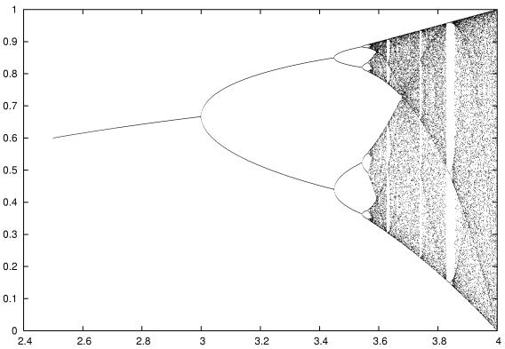

## How to test

Assuming the ASIC is connected to the [TT demo board]
and suitable interface electronics have been connected (see "External hardware"),
select the `tt_um_zec_square1` project to get started.
If `rst_n` is not automatically set to logic high upon selection, you'll need to manually disable the reset.
Enable the reset again when you're done.

If not using the demo board, you'll need to supply the ASIC with a
25.175&nbsp;MHz or 25.200&nbsp;MHz clock and use the pinout to connect
to video and audio output devices. Note: <em>x</em>1 and <em>x</em>0 are the high-order
and low-order bits of color component <em>x</em>.

The video part of the demo repeats with a cycle time of ~8.5 seconds,
while the audio part repeats with a cycle time of just under 2 minutes.

## External hardware

Assuming the ASIC is connected to the [TT demo board],
VGA output is obtained by connecting a [Tiny VGA Pmod] or compatible module to the OUTPUT Pmod connector,
and audio output is obtained by connecting a [Tiny Tapeout Audio Pmod] to the BIDIR Pmod connector.

## How it works

SQUARE-1 contains a VGA-compatible video demo and an independent audio demo,
described separately below.

### Video

&nbsp;

### Audio

The audio demo is a sonification of the [logistic map].
To give a quick overview, the following iteration:

$x_{i+1} \leftarrow r x_i (1 - x_i)$

takes values of $x \in (0, 1)$ to values in $(0, 1)$
when $r \in (1, 4)$. When $r \in (1, 3]$, the sequence
of $x_i$ values converges to a single value, but much more interesting
behavior happens when $r \in (3, 4)$:

 Credit: Ap on en.wikipedia.org

&nbsp;

## Greetz

Eh, I'm not _that_ social&hellip;

&hellip;Hi, Mom! Hi, Dad!

Well, also, thanks to the organizers of the demoscene competition for finally
inspiring me to get off my rear and go sculpt some silicon.
Thanks as well to the open source EDA and silicon communities for making
all this feasible.

[TT demo board]: https://tinytapeout.com/specs/pcb/
[Tiny VGA Pmod]: https://github.com/mole99/tiny-vga
[Tiny Tapeout Audio Pmod]: https://github.com/MichaelBell/tt-audio-pmod
[logistic map]: https://en.wikipedia.org/wiki/Logistic_map
