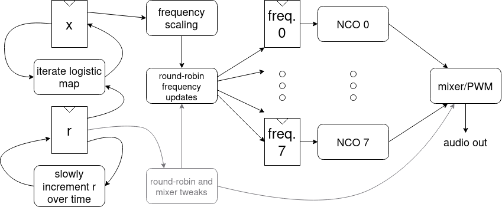

## How to test

Assuming the ASIC is connected to the [TT demo board]
and suitable interface electronics have been connected (see "External hardware"),
select the `tt_um_zec_square1` project to get started.
If `rst_n` is not automatically set to logic high upon selection, you'll need to manually disable the reset.
Enable the reset again when you're done.

If not using the demo board, you'll need to supply the ASIC with a
25.175&nbsp;MHz or 25.200&nbsp;MHz clock,
do the appropriate interactions with the project-selection logic to select `tt_um_zec_square1`,
and use the pinout to connect
to video and audio output devices. Note: <em>y</em>1 and <em>y</em>0 are the high-order
and low-order bits (respectively) of color component <em>y</em>.

The video part of the demo repeats with a cycle time of ~8.5 seconds,
while the audio part repeats with a cycle time of just under 2 minutes.

## External hardware

Assuming the ASIC is connected to the [TT demo board],
VGA output is obtained by connecting a [Tiny VGA Pmod] or compatible module to the OUTPUT Pmod connector,
and audio output is obtained by connecting a [Tiny Tapeout Audio Pmod] to the BIDIR Pmod connector.

## How it works

SQUARE-1 contains a VGA-compatible video demo and an independent audio demo,
described separately below.

### Video

While the demoscene dates to the mid-1980s, people have been making
aesthetically-interesting graphics with a tiny amount of code for much longer.
One of the earliest "display hacks"
is [munching squares], first implemented _c._ 1962 on
MIT's [PDP-1] (hence the demo's name).
The original version has feedback and user-configurability
(see [Norbert Landsteiner's write-up] for more details and a PDP-1 emulator),
but a simple variant requires only two $N$-bit
variables&mdash;`t`, a frame counter, and `y`, a row counter, used thus:

```plain
t ← 0
loop
  wait for end of frame
  t ← (t + 1) mod 2^N
  for y ← 0 to 2^N-1
    plot (t XOR y, y)
```

As the algorithm has so little state and involves simple operations,
a "racing the beam" implementation requires little silicon area.
SQUARE-1 uses $N = 9$ and accepts that the bottom bit of the square gets
lost off the 640×480 screen.

_However,_ the results of a simple implementation of the algorithm would not
_look_ much like the original version!
PDP-1 munching squares uses a Type 30 point display, which was built around
a radar-scope CRT using P7 phosphor.
P7 is actually a combination of two substances&mdash;a bright, short-persistence
(decay constant ~20 microseconds) far-blue phosphor excited by
the electron beam, and a dimmer, long-persistence
(main decay constant ~100 milliseconds,
but with a long tail lasting ~seconds)
yellow phosphor excited by the light from the
blue phosphor. As a result, the points currently being plotted have a
white or blue-white appearance, then become yellow and visibly fade away.

Fortunately, since each frame only has one point in each line, and said
point is different in each frame, it's easy to parallelize
an emulation of persistence, which is done in `src/project.v`, which
conceptually works like this:

&nbsp;

Apart from the VSync/HSync/coordinate-generating module, it's almost entirely
combinational logic. SQUARE-1 simulates 14 frames (~1/4 second) of
persistence prior to the current frame&mdash;not quite a Type 30,
but enough to get the feel of the thing on modern displays.

### Audio

The audio demo is a sonification of the [logistic map].
To give a quick overview, the following iteration:

$$x_{i+1} \leftarrow r x_i (1 - x_i)$$

maps values of $x \in (0, 1)$ to values in $(0, 1)$
when $r \in (1, 4)$. When $r \in (1, 3]$, the sequence
of $x_i$ values converges to a single value (the _attractor_),
but much more interesting behavior happens when $r \in (3, 4)$:


<br />Credit: Ap on en.wikipedia.org

First, the attractor becomes a period-2 cycle, then period-4, -8, -16&hellip;
and then it exhibits chaotic behavior.
That iteratively applying a quadratic polynomial would result in such behavior
came as quite a surprise back in the 1960s,
and to this day the logistic map is
a popular demonstration of mathematical chaos in a simple system.

So, what does it mean to turn the logistic map into a sound?
The way SQUARE-1 does it, values of $x_i$ at a given $r$ are scaled
from $(0, 1)$ to approximately $(200, 1200)$&nbsp;Hz, which are
then used as the frequencies of an ensemble of 8 square-wave generators.
The square waves are then added together and used
as the input to a PWM generator,
the last providing the sound output.
$r$ is varied to cover the range $[\tfrac{17}{16}, 4)$ over a period of ~2 minutes,
varying faster over $r < 3$ to get to the good stuff sooner.

Finally, over a few small portions of the chaotic region, we change the
number of square-wave generators that get frequency updates
and get mixed together. The reason is that within the chaotic region,
there are islands of periodicity, the largest of which have attractors
of period 3, 5, and 6. Tweaking the number of active generators to be a
multiple of the period leads to better-sounding results within the islands.

&nbsp;

## Greetz

Eh, I'm not _that_ social&hellip;

&hellip;Hi, Mom! Hi, Dad!

Well, also, thanks to the organizers of the TT08 demoscene competition
for finally inspiring me to get off my rear and go sculpt some silicon.
Thanks as well to the open source EDA and silicon communities for making
all this feasible.

[TT demo board]: https://tinytapeout.com/specs/pcb/
[Tiny VGA Pmod]: https://github.com/mole99/tiny-vga
[Tiny Tapeout Audio Pmod]: https://github.com/MichaelBell/tt-audio-pmod
[munching squares]: https://en.wikipedia.org/wiki/Munching_square
[PDP-1]: https://en.wikipedia.org/wiki/PDP-1
[Norbert Landsteiner's write-up]: https://www.masswerk.at/minskytron/
[logistic map]: https://en.wikipedia.org/wiki/Logistic_map
